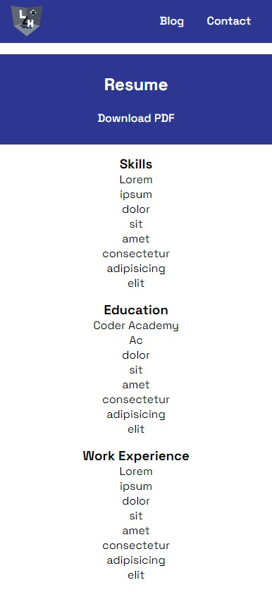

# Lukas Halloran's Portfolio Website

Welcome to my portfolio website repository! 

View the deployed website at: [lzhalloran.netlify.app](https://lzhalloran.netlify.app/)

My GitHub Repo: [github.com/lzhalloran/Portfolio](https://github.com/lzhalloran/Portfolio)

## Description

### Purpose
Showcase my talent, abilities and experience to potential employers and/or clients

### Functionality / Features
- landing page with hero section and link to resume
- sticky navbar present across all pages at all times
- blog page with blog posts generated by ChatGPT, images, and an interactive blog list (using radio button hack for selection)
- contact page with links to resume, mailto email link, and external profiles (GitHub and LinkedIn)
- resume page with link to download PDF
- animations (slide in, fade in/out, grow on hover)

### Sitemap

### Screenshots

### Target Audience
Prospective employers, assumed to have technical knowledge relating to software development, languages and stacks, with expectations of professionalism and a positive work ethic

### Tech Stack
- html
- css / sass
- netlify

### References
- bogitw. (2015). Silvery Mother-of-pearl butterfly, Pixabay. https://pixabay.com/photos/silvery-mother-of-pearl-butterfly-877121/
- jennyzhh2008. (2015). Lotus flower bloom blossom, Pixabay. https://pixabay.com/photos/lotus-flower-bloom-blossom-978659/
- Kanenori. (2019). Rainforest Path Morning Mist Asahi, Pixabay. https://pixabay.com/photos/rainforest-path-morning-mist-asahi-4350845/
- Oyedele, H. (2023). CSS Accordion. Codepen. Retrieved 1/06/2023 from https://codepen.io/devhammed/pen/WzPgbX?editors=1100
- Sergio-sq. (2023). Moon phases eclipse sky, Pixabay. https://pixabay.com/photos/moon-moon-phases-eclipse-sky-8006703/
- Vero-Fasching. (2023). Mountains Mountain Goat Ibex, Pixabay. https://pixabay.com/photos/mountains-mountain-goat-ibex-8027230/

