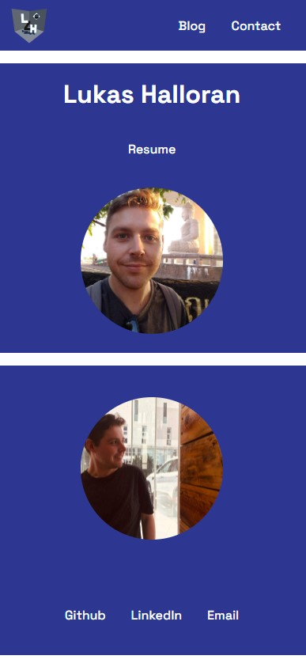
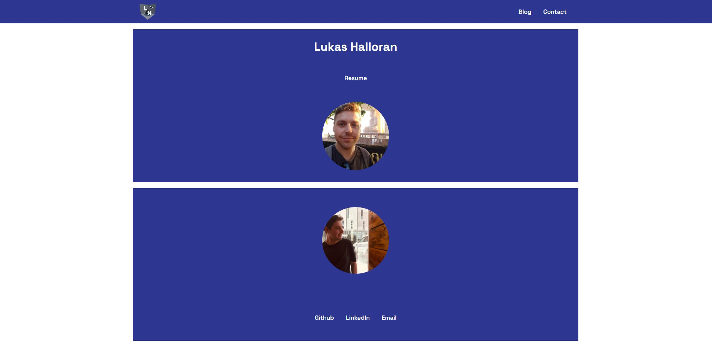

# Lukas Halloran's Portfolio Website

Welcome to my portfolio website repository! 

View the deployed website at: [lzhalloran.netlify.app](https://lzhalloran.netlify.app/)

My GitHub Repo: [github.com/lzhalloran/Portfolio](https://github.com/lzhalloran/Portfolio)

## Description

### Purpose
Showcase my talent, abilities and experience to potential employers and/or clients

### Functionality / Features
- landing page with hero section and link to resume
- sticky navbar present across all pages at all times
- blog page with blog posts generated by ChatGPT, images, and an interactive blog list (using radio button hack for selection)
- contact page with links to resume, mailto email link, and external profiles (GitHub and LinkedIn)
- resume page with link to download PDF
- animations (slide in, fade in/out, grow on hover)

### Sitemap

### Screenshots

### Target Audience
Prospective employers, assumed to have technical knowledge relating to software development, languages and stacks, with expectations of professionalism and a positive work ethic

### Tech Stack
- html
- css / sass
- netlify